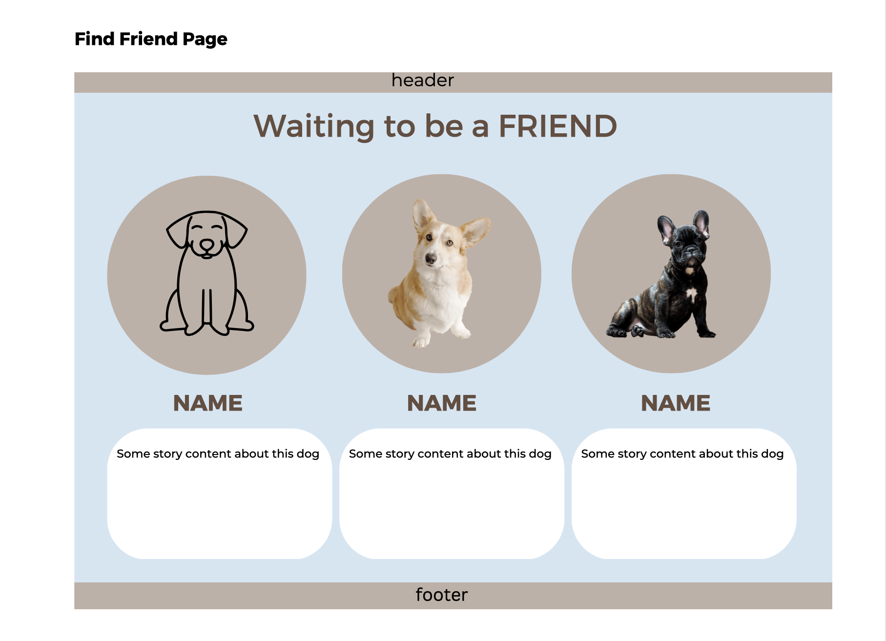
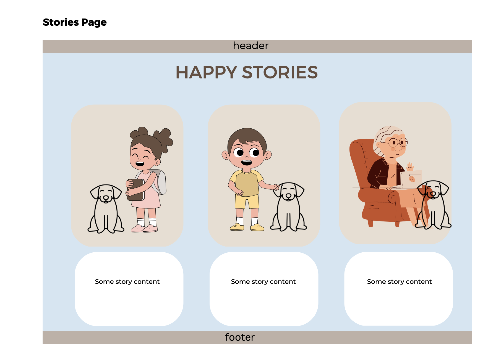

# Fluffy Friends Limerick 🐾 🐶

Fluffy Friends Limerick is the site which main goal is to adopt homeless dogs, to protect, provide, shelter, support the dogs, and promote human care for pets across the Limerick and all the Ireland.

🔗[View the live project here.](https://ksumm.github.io/fluffy-friends/index.html)

## Target

The site is target to people who loves dogs and want to help animals.

## User Stories

- As a user, I want to definitely understand the main purpose about the site.
- As a user, I want to easily find the information about the organization.
- As a user, I want to easily navigate the site.
- As a user, I want to easily find the information about the dogs that need to be adopted.
- As a user, I want to make a donation.
- As a user, I want to select the amount of donation.
- As a user, I want to read stories about the dogs that was adopted.
- As a user, I want to find the contact information about the organization.
- As a user, I want to associate with the organization social media pages.

## Technologies Used:

### Languages

-   [HTML5](https://en.wikipedia.org/wiki/HTML5)

-   [CSS3](https://en.wikipedia.org/wiki/Cascading_Style_Sheets)

### Frameworks, Libraries & Programs Used

-   [Canva](https://www.canva.com)
     
    - Canva was used to create the wireframes and logo.

-  [Font Awesome](https://fontawesome.com/icons) 

    - Font Awesome icons was used in creating the content of the site.

-   [Google Fonts](https://fonts.google.com/)    

    - The Google Fonts was used:

        - [Montserrat](https://fonts.google.com/specimen/Montserrat/)

        - [Roboto](https://fonts.google.com/specimen/Roboto)

- GitHub Pages

    - This project was deployed on GitHub pages.

- [Freepik](https://www.freepik.com/popular-photos)

    - This project uses Freepick for images.  
    
- [Imagecolorpicker](https://imagecolorpicker.com)  

   Imagecolorpicker was used to choose the colour scheme.   

## UI/UX

### Logo

The Logo was created on [Canva](https://www.canva.com/).

### Colour Scheme

The colour scheme was choosen using the [Imagecolorpicker](https://imagecolorpicker.com)  

### The main colors used:

- #3a3a3a
- #d4e5f3
- #2a1e16
- #fff

### Wireframes

- Wirefranes was created in [Canva](https://www.canva.com)

## Testing

The W3C Markup Validator and W3C CSS Validator Services were used to validate every page of the project to ensure there were no syntax errors in the project.

-   [W3C Markup Validator](https://jigsaw.w3.org/css-validator/#validate_by_input) - [Results](https://validator.w3.org/nu/?doc=https%3A%2F%2Fksumm.github.io%2Ffluffy-friends%2Findex.html)

-   [W3C CSS Validator](https://jigsaw.w3.org/css-validator/#validate_by_input) - [Results](https://jigsaw.w3.org/css-validator/validator?uri=https%3A%2F%2Fksumm.github.io%2Ffluffy-friends%2Findex.html&profile=css3svg&usermedium=all&warning=1&vextwarning=&lang=uk)

-   Lighthouse Devtools was used to check the accessibility, performance, and SEO:

### Known Bugs

-   On landscape mode on small mobile devices the Find A Friend button is shown out of the text-section.

## Responsive

[Am I Responsive](https://ui.dev/amiresponsive) was used to check the responsive of the site: 

## Deployment

### GitHub Pages

The project was deployed to GitHub Pages using the following steps:

1. Log in to GitHub and locate the [GitHub Repository](https://github.com/)

2. At the top of the Repository (not top of page), locate the "Settings" Button on the menu.

    - Alternatively Click [Here](https://raw.githubusercontent.com/) for a GIF demonstrating the process starting from Step 2.

3. Scroll down the Settings page until you locate the "GitHub Pages" Section.

4. Under "Source", click the dropdown called "None" and select "Master Branch".

5. The page will automatically refresh.

6. Scroll back down through the page to locate the now published site [link](https://github.com) in the "GitHub Pages" section.

### Forking the GitHub Repository

By forking the GitHub Repository we make a copy of the original repository on our GitHub account to view and/or make changes without affecting the 

original repository by using the following steps:

1. Log in to GitHub and locate the [GitHub Repository](https://github.com/)

2. At the top of the Repository (not top of page) just above the "Settings" Button on the menu, locate the "Fork" Button.

3. You should now have a copy of the original repository in your GitHub account.

### Making a Local Clone

1. Log in to GitHub and locate the [GitHub Repository](https://github.com/)

2. Under the repository name, click "Clone or download".

3. To clone the repository using HTTPS, under "Clone with HTTPS", copy the link.

4. Open Git Bash

5. Change the current working directory to the location where you want the cloned directory to be made.

6. Type `git clone`, and then paste the URL you copied in Step 3.

$ git clone https://github.com/YOUR-USERNAME/YOUR-REPOSITORY

7. Press Enter. Your local clone will be created.

$ git clone https://github.com/YOUR-USERNAME/YOUR-REPOSITORY

> Cloning into `CI-Clone`...

> remote: Counting objects: 10, done.

> remote: Compressing objects: 100% (8/8), done.

> remove: Total 10 (delta 1), reused 10 (delta 1)

> Unpacking objects: 100% (10/10), done.

Click [Here](https://help.github.com/en/github/creating-cloning-and-archiving-repositories/cloning-a-repository#cloning-a-repository-to-github-desktop) to retrieve pictures for some of the buttons and more detailed explanations of the above process.

## Credits

-   Images were taken from [Freepik](https://www.freepik.com/popular-photos)

-   Content was written by developer

 
